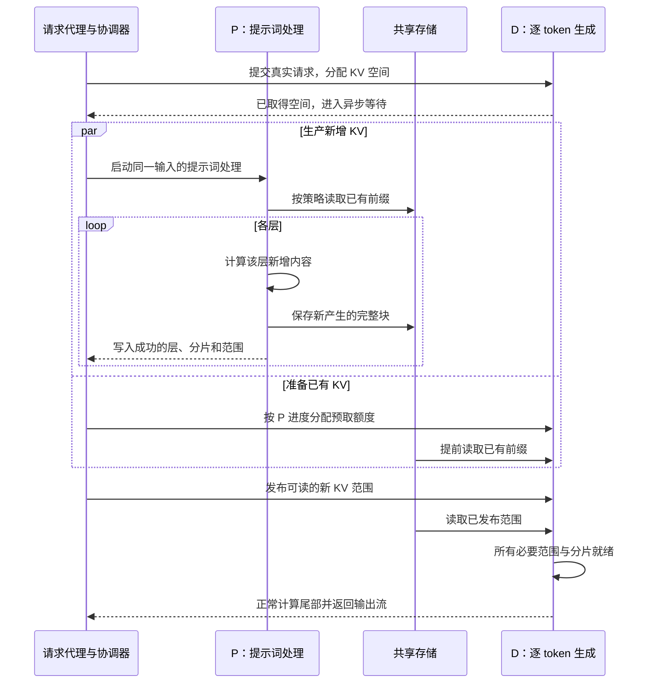

# E004：按 P 端进度协调 D 端预取

**推荐方案是：请求接收后先给生成端准备空间，在提示词处理期间提前读取已有前缀，并根据生产进度协调两端的存储任务。** 方案要回答：同样提前获知请求时，怎样让预取真正缩短等待，同时给正在计算的请求保留足够的存储能力？

提示词处理端记为 P（Prefill），逐 token（模型处理的基本单元）生成端记为 D（Decode）；KV 缓存保存注意力计算中的键和值。逐层执行（layerwise）把模型的每一层作为加载、计算和保存的衔接单位。

正文依次解释机制、决策、实现、验证和交付；附录提供执行参数、代码与论文依据，以及环境和验证状态。需求与完整用户原文见 [Requirements](Requirements.md)。

## 1. 用 P 的计算时间准备 D 所需的数据

这套方案把同一请求的 KV 分成已有前缀与新增内容，再让两部分在 D 汇合。

### 1.1 已有前缀从存储提前进入 D

例如，一次文档问答包含约 6 千 token 的已缓存材料，以及约 2 千 token 的新增上下文和问题。P 需要恢复或重算前缀，再计算新增内容；D 最终需要两部分 KV 才能继续生成。

请求到达时，代理先确定 P、D 的配对。D 为这条真实请求分配设备上的 KV 空间，并进入异步等待。此时已有前缀可以从共享存储直接读入 D；P 同时处理自己的计算任务。这段提前量来自请求本身的生产过程。

### 1.2 新增内容在 P 写入完成后进入 D

P 完成某层的新增 KV 后，将相应完整缓存块写到共享存储。设备写入事件与源缓冲区保留到存储任务实际完成；写入成功后发布完成记录，D 再读取对应范围。已有前缀保持复用，新产生的内容逐层交接。

D 将“已有前缀恢复完成”和“P 新产生的必要 KV 恢复完成”合并为就绪条件。所有张量并行分片都完成后，D 执行尾部 token 的正常计算，并返回用户输出。张量并行（TP）指多个设备共同执行一个模型，各自持有一部分计算和 KV。

以下时序图只展示数据依赖；协调器控制各项存储任务何时提交。



### 1.3 新增决策协调两端对存储的使用

已有工作提供了重要基础：推理框架 SGLang 已支持 D 从分层缓存恢复前缀、P 只交付增量；统一缓存管理项目 UCM 已提供存储式 PD 交接和下一层提前加载。E004 在这些能力之上增加一项具体决策：**根据 P 的剩余生产时间，安排 D 的前缀读取额度和顺序，并把 P 的恢复选择纳入同一个就绪目标。** [SGLang 官方路线图](https://github.com/sgl-project/sglang/issues/21703)、[UCM 存储式 PD 文档](https://ucm.readthedocs.io/en/latest/user-guide/pd-disaggregation/centralized_pd.html)

这项决策最有价值的情形，是几个请求同时使用同一存储：有的 P 很快就能完成，有的还有较长的新增内容要计算。协调器优先补齐即将被消费的 KV，同时保护 P 正在等待的读取；较晚才需要的 D 前缀利用后续空隙完成。直接对照是拥有相同信息、资源和执行能力的立即预取策略。

## 2. 围绕共同就绪时间作出决策

本节依次说明 D 的预取决策、P 的恢复决策，以及两者共同就绪后的收益估算；目标是让用户更早收到 D 的首个 token。

### 2.1 D 按剩余时间安排预取

协调器为每条请求估计两个时间：P 的新增 KV 何时能在 D 就绪，以及 D 的已有前缀还需要多久才能读完。前者由 P 的逐层进度、剩余计算和新增数据交接成本更新；后者由尚未读取的字节、队列长度和近期实际传输耗时估计。

两者之差表示前缀预取还有多少余量。例如，P 的剩余工作预计需要 80 毫秒，D 还需 30 毫秒读取前缀，则约有 50 毫秒可用于安排其他更紧急的任务。若 P 已接近完成而 D 仍需 30 毫秒，前缀读取就成为主要等待来源。

协调器只调整尚未提交的任务，执行以下规则：

1. P 正在等待的层读取，以及已经阻塞 D 完成的新 KV 交接，优先获得提交额度。
2. D 的前缀读取按剩余余量从小到大安排；同余量按请求到达顺序处理。
3. P 的下一层提前加载继续保留。存储仍有空闲额度时，D 可以提前读取余量较大的前缀。
4. 每次完成事件归还额度并更新估计；一个已提交任务自然完成后，才调整后续任务的次序。

初版使用固定且有上限的任务粒度和在途窗口。高优先级任务与 D 预取共享同一个总预算，立即预取基线使用相同预算。策略的改进来自分配次序与生产进度，资源额度保持可比。

### 2.2 P 按剩余成本选择加载或重算

P 只采用两种动作：加载整段可用外部前缀，或保留本地有效前缀并重算其余输入。两种动作都正常计算新增内容，并保留现有逐层执行。选择发生在调度器承诺外部命中长度之前；接受长度、加载范围和后续计算范围一次确定。

比较时同时估计 P 的完成时间和 D 的前缀恢复时间。P 选择重算可以减少自己对共享存储的读取，却增加计算；P 选择加载则可能更快开始后缀计算。协调器选择预计共同就绪更早的动作，并用标定误差作为切换余量。成本接近时沿用加载路径，减少不必要的决策抖动。

已经读取完的数据直接计入剩余工作。统计实验总成本时，再完整计入这些已发生的读写与占用。D 端初版采用完整恢复加正常尾部计算，P 承担主动加载／重算选择。

### 2.3 估算共同就绪时间与收益空间

预取的直接收益上限来自原本暴露在关键路径上的读取时间。以一个明确的演算为例：P 计算及最后新块写出共 80 毫秒，D 前缀读取 50 毫秒，最后新块读取 15 毫秒，D 尾部计算 5 毫秒。晚读前缀的简化路径为 150 毫秒；前缀能在 P 工作期间读完时约为 100 毫秒，节省 50 毫秒。这个例子说明怎样估算机会窗口；逐层交错后的实际收益由事件时间线计算。

模型规模决定搬运量。按官方配置推算，BF16（每个数值占 2 字节）的 Qwen2.5-7B KV 约为每 token 56 KiB，6144-token 前缀合计约 336 MiB；14B 对应约 192 KiB 和 1.125 GiB。数据量按两个 TP 分片合计。实施前用真实布局和实际有效带宽替换估算，即可得到前缀恢复时间及其与 P 计算窗口的关系。[7B 配置](https://huggingface.co/Qwen/Qwen2.5-7B-Instruct/blob/main/config.json)、[14B 配置](https://huggingface.co/Qwen/Qwen2.5-14B-Instruct/blob/main/config.json)

预期效果分两项判断：提前恢复相对晚恢复应有可观的窗口收益；进度协调相对立即预取应在共享存储竞争下增加收益或减少对生成请求的干扰。具体百分比采用标定后的预测区间，实测报告分别给出两项结果。

## 3. 用 UCM 的异步协议实现完整链路

实现分为请求协调、两端连接器和存储任务执行三个部分，各自承担明确职责。

### 3.1 请求协调器维护配对、额度和完成记录

新增代理为同一请求分配稳定的关联标识，先登记 P 的生产承诺，再提交 D 的真实生成请求，待 D 取得空间后启动 P。生产承诺包含完整输入身份、选定 P 和终止规则；P 启动失败会使对应承诺失败并通知 D。代理同时提供轻量协调服务，保存 P/D 配对、存储任务队列、进度估计和写入完成记录。该服务传递控制消息，KV 数据通过存储接口搬运。

P 的内部请求只负责产生 prompt KV；用户输出全部来自 D。P 的内部单 token 参数与正式性能统计分开处理，正式请求按 D 的实际输出计算指标。代理的排队、D 空间等待和配对耗时全部包含在客户端计时内。

### 3.2 两端连接器分别维护生产和消费状态

新增 `KVReadyConnector`，在 P 侧复用普通逐层连接器的地址和布局处理，在 D 侧实现完整的异步接收协议。D 可以承诺随后由 P 提供的数据，先分配空间并进入 `WAITING_FOR_REMOTE_KVS`（等待远端 KV 的调度状态）；外部 token 数量表示承诺恢复的范围，真实可消费状态由完成事件决定。

D 的接收元数据独立保存，使没有模型计算步骤时，加载与完成检查仍能推进。全部必要范围在所有 TP 分片完成后，通过 `get_finished` 报告接收完成，调度器再允许 D 计算。两端使用相同模型身份、分片编号、布局和块键。

P 的保存完成记录精确到“请求、分片、层、块范围”。D 根据记录读取新范围；已有前缀根据准备阶段确认的完整对象读取。P 初版在保存等待阶段确认已排队任务全部成功后才释放本次计算的数据，以清楚的生命周期保证数据交接。

### 3.3 存储执行器维护真实完成和缓冲区生命周期

执行器把加载与保存组织为有界任务。模型钩子将下一层任务加入本地队列，后台提交线程取得协调额度后调用真实的 `load_data` 或 `dump_data`；等待当前层时只等待该层任务。这样保留下一层读取与当前层计算的重叠。

ASU（实验采用的外部存储后端）已有异步任务和完成查询。执行器先查询任务确实完成，再收取最终结果；成功结果产生就绪记录，失败结果终止该请求的比较。已经提交的数据搬运继续持有原缓冲区和额度，直到完成得到确认。

所有正确性路径共用四条不变量：块身份与输入一致；加载和重算范围完整覆盖所需上下文；所有分片在消费前完成；缓冲区在底层访问结束后复用。安全样例围绕这四项检查，测试深度与主流程风险相匹配。

## 4. 用有限对照回答三个交付问题

验证分为策略收益、物理路径和运行有效性三部分；每部分使用固定对照或检查条件，详细配置见附录 A。

### 4.1 区分提前量与新增策略收益

主实验固定同一存储执行器、逐层能力、D 空间分配时机和资源预算，依次比较四种模式：P 完成后才开始 D 前缀读取；D 立即预取；D 按 P 进度协调预取；在协调预取之上加入 P 的加载／重算选择。

前两种之差回答提前量价值；中间两种之差回答预取协调价值；后两种之差回答恢复选择价值。每种模式重放相同输入和到达序列，并采用相同尾部计算范围。代码中的模式开关只切换对应决策。

主场景选常见的文档问答或多轮会话，包含长前缀、短新增内容，以及较短前缀、较长新增内容两类。场景表示一次已有外部 KV、D 尚未驻留的会话接管。不同会话族有独立前缀，两个固定批次交换模式执行顺序，减少先后次序影响。

每次比较使用独立的实验存储命名空间，P、D 在同一模式内共享它。相同输入在每个命名空间中只预置相同前缀；模式之间通过命名空间隔离完整 KV。实验对象保留到整个固定包结束，启动前统一核算累计空间，详细结果独立保存。测试确认准备写入和两端本地缓存清理成功后，再开始正式请求。

### 4.2 判断存储路径能否减少互联争用

路径演示单独比较直接 P→D 搬运和 P→存储→D 搬运，采用相同字节、分片与层释放顺序。已有前缀从外部进入 D 的开销也单独列账；新增后缀的存储路径包含保存、完成发布和读取三部分。

每条路径分别运行独立 KV 搬运、叠加专家交换代表通信两种状态，另测代表通信单独运行的参照。代表通信采用 HCCL（昇腾集合通信库）的固定规模交换，使用与推理阶段相同的已授权设备，演示期间与正式模型服务分阶段运行。

记录 KV 的完成时延、代表通信的完成时延和实际通道配置。若直传叠加通信后双方明显变慢，而存储路径的总开销及通信干扰更小，则支持在该拓扑下进一步验证存储分流。若存储路径仍竞争相同设备、内存或互联资源，报告给出实际共享位置和限制条件。DualPath 对共享计算网络上的 KV 与专家通信竞争已有分析，可作为判断框架。[DualPath §5](https://arxiv.org/html/2602.21548v2#S5)

### 4.3 把正确性和反馈成本固定在测试入口

运行前先检查带标准答案的少量文档问题，让答案分别依赖已有前缀与新增内容；同时检查块身份、范围和实际搬运完成。缓存传输抽样比较同一份源数据与读回数据。性能统计再检查每请求一条记录、实际输出长度、有限时延和事件顺序。

每批输出一条总体状态与少量对照摘要。用户只需反馈这些行；输入、完整输出、逐层事件和详细版本保存在黄区。发生错误时摘要给出首个失败阶段，停止该批次，由蓝区分析后集中修复。

完成固定样例和请求数即收口。新增策略的收益、持平或退化都进入结论，后续决策由测量结果支持。

## 5. 形成可拉取的实现和主管交付

交付按方案确认、蓝区实现、黄区验证和结果分析依次推进，每一步提供下一步可以直接使用的产物。

方案确认后，从 E003 的核验起点建立 `kvready/e004`。实现先完成任务生命周期和异步接收，再加入贪心预取、进度协调与恢复选择；各项对照共用执行器。专用测试覆盖真实会影响主流程的范围、完成与异常传递，随后完成可在蓝区运行的接口检查和代码审阅。

交给黄区的内容包括分支和提交、原目录保全与切换步骤、环境配置模板、服务就绪标志、固定测试包、通信演示和统一反馈格式。现场模型路径、专用存储容量等通过变量填写；命令的预期输出和条件分支指导后续动作。详细配置与日志保留在黄区，正常流程完成后回传四行摘要，失败批次按运行说明结束并汇总。已有运行环境、解释器和编译产物优先复用。

最终报告按三个问题组织结论：预取提前量有多大价值，新增协调与恢复选择带来多少增量，存储路径在哪些条件下能够减少互联争用。正文解释机制和结果，附录保存数据、版本、配置和验证范围。

## 附录 A. 执行与测试规格

本附录把正文中的决策落实为动作范围、成本表达、模块职责和有限测试参数。

### A.1 动作范围与状态契约

设完整输入有 `n` 个 token，缓存块大小为 `b`，D 的完整块恢复边界为 `c = floor((n - 1) / b) × b`。D 恢复 `[0,c)`，正常计算 `[c,n)`，尾部长度为 1 到 b。D 已有本地有效前缀记为 `hD`，新增外部承诺为 `max(0,c-hD)`；大于零时才使用异步接收。所有实验模式统一这一边界。

P 实际外部命中边界记为 `r`，P 本地有效前缀记为 `hP`。加载动作接受 `[hP,r)`，同时执行原连接器对完整命中的尾 token 保留规则；重算动作接受长度回到 `hP`。`r` 与选定加载边界分别保存。

D 的已有对象边界为 `rD=min(r,c)`。D 读取已有对象的范围为 `[hD,rD)`，读取新对象的范围为 `[max(hD,rD),c)`；起点大于或等于终点的范围为空。P 重算已有前缀时保留原存储对象，仅发布原来缺失且 D 需要的完整块。任务、就绪集合和字节统计都按裁剪后的范围生成。

| 对象 | 必须保存的内容 | 完成条件 |
|---|---|---|
| 请求身份 | 实验命名空间、模型与分词器身份、精度、布局、块大小、TP 分片、输入块键、请求关联标识 | P/D 配置与块身份一致 |
| P 恢复计划 | 原始命中 `r`、本地命中 `hP`、选定加载边界、加载块、计算范围 | 调度承诺与 worker 元数据一致 |
| D 接收计划 | `c`、`hD`、已有前缀范围、新增范围、已完成的 rank/layer/block 集合 | 全部必要范围及分片已成功写入目标 KV 空间 |
| 写入完成记录 | 请求代次、分片、层、范围、存储任务终态 | 实际保存成功后发布 |
| 存储任务 | 操作、字节、目标地址、任务 ID、所属请求、额度、生命周期 | 完成查询确认后收取一次结果 |

正常状态为 `已接收 → D 已分配 → P 生产与 D 预取并行 → 全部必要 KV 就绪 → D 计算与输出 → 释放`。取消或失败先停止新任务提交；在途任务继续持有地址和额度，实际终结后统一清理。

### A.2 可实现的调度与成本表达

对请求 i，在时刻 t 估计：

```text
producer_ready(i) = 从时刻 t 出发，按 P 剩余层工作和新 KV 保存/读取依赖推算的完成时刻
prefix_remaining(i) = D 已有前缀尚未完成的读取时间（包含已提交任务的剩余时间）
slack(i) = producer_ready(i) - t - prefix_remaining(i) - estimation_margin
finish(i, action) = max(producer_ready(i, action), prefix_ready(i, action))
                    + D 尾部计算与正常调度等待
```

`producer_ready` 按层事件的依赖推算，允许计算与读取重叠；累计服务耗时单独统计。每次提交前优先处理已经阻塞计算或交接的任务，再从最小 slack 的 D 预取任务中选择。已提交任务保持原物理操作；无竞争且有额度时继续预取，保持空闲资源可用。

P 在 `LOAD / RECOMPUTE` 两动作中比较 `finish`。切换余量取标定中观测到的估计误差与协调开销，标定信息不足时采用 LOAD 并记录原因。全局主实验使用固定标定参数，逐层进度用于更新剩余工作；实验中途保持相同参数，便于复现。

初版同一请求的一项任务由一个层上的连续块组成；字节超过配置上限时按完整块拆分。一个任务至少容纳一个合法块。所有 TP 分片使用同一逻辑顺序，实际完成分别记录。P 的动作由调度器（scheduler）一次选择并写入元数据，各工作进程（worker/rank）执行同一动作。协调器使用自己的时钟记录收到的进度事件，worker 只上报同进程测得的耗时。P 的钩子只入队，提交线程领取额度，避免在“提交下一层”处同步等待协调器。

额度按每项独立存储任务在完成查询和结果收取后立即归还；全 rank 就绪屏障仅决定请求何时可以消费，二者分开维护。每个 rank 对每个请求只报告一次接收完成。保存任务在模型线程记录设备事件，将事件、不可变地址和块键副本一起入队；专用保存等待函数覆盖排队及已提交任务，全部终结后统一销毁事件。每项成功保存仍可立即发布完成记录。

### A.3 模块与修改范围

以下路径对应最小实现，均相对于 UCM 仓库；协议状态合并到协调器，样例由一个生成模块提供。

| 目标位置 | 专一职责 |
|---|---|
| `ucm/integration/vllm/kvready_connector.py` | P 逐层生产、D 异步元数据及完成报告，复用已有地址/布局转换 |
| `ucm/kvready/policy.py` | 剩余时间、优先级和 P 的两动作选择，纯数据输入输出 |
| `ucm/kvready/coordinator.py` | 请求身份、范围、完成记录、命名空间和共享任务额度 |
| `ucm/kvready/executor.py` | 本地有界队列、额度、ASU 任务提交与完成收取 |
| `ucm/pd/kvready_proxy.py` | 真实 D 请求先分配、P/D 关联、协调服务和 D 输出转发 |
| `test/kvready_e004/test_control.py`、`test_connector.py`、`test_executor.py` | 分别检查决策与协议、连接器范围与完成、存储任务生命周期 |
| `test/kvready_e004/test_runner.py` | 样例构造、请求契约和配对统计的必要检查 |
| `test/kvready_e004/test_pd.py` | 准备、正确性、四模式性能批次与完成条件 |
| `test/kvready_e004/test_transfer.py` | 同字节传输路径与通信争用演示 |
| `test/kvready_e004/report.py` | 有效性判定、配对汇总与少量手抄摘要 |
| `test/kvready_e004/workload.py`、`docs/kvready_e004/` | 自包含样例、配置模板、黄区运行说明和结果口径 |

通过连接器模块路径加载新增实现，默认 UCM 路径保持原有选择。首版目标是 UCM 仓库内完成实现，沿用框架已有异步接口。专用测试入口隔离历史 `test/conftest.py` 的设备管理副作用，由自己的测试根管理配置。

### A.4 固定测试批次

| 项目 | 初版建议值与规则 |
|---|---|
| 模型 | 首选现场已有且稳定的 Qwen2.5-14B-Instruct；若未具备部署条件，选已有 7B。正式比较固定一个模型；0.5B 仅用于连通性检查 |
| P/D 配置 | 每端 TP=2，相同模型、BF16、KV 布局和 block size；首版采用框架 eager（即时执行）模式，固定相同调度参数 |
| 输入 | 正常文档或会话内容；长前缀约 6144、新内容约 2048 token；短前缀约 2048、新内容约 6144 token。按实际分词和完整块记录 |
| 输出与并发 | 正式性能固定输出 128 token，采样 temperature=0；使用框架已支持的最小输出长度或忽略 EOS（结束标记）参数，并核对实际计数。正确性请求自然结束。客户端最多 4 条实际在途，请求按固定计划到达时间进入有界队列 |
| 请求与命名空间 | 每模式每类 20 个会话族；2 个固定批次，每批每模式独立命名空间，输入完全配对；每个被测请求为其会话族在 D 的首次访问 |
| 主性能规模 | 2 类 × 4 模式 × 20 请求 × 2 批次 = 320 条正式请求；预置请求与标定单独计数及计费 |
| 标定规模 | 2 类输入 × P 的 2 动作 ×（2 次预热＋3 次记录）=20 条生产端请求；实际读写耗时同时记录 |
| 正确性规模 | 4 条带标准答案的请求 × 4 模式 =16 条，覆盖对前缀和新增内容的依赖；小规模同源数据传输比较随连接器测试执行 |
| 预置规模 | 每个模式、批次、会话族只准备对应前缀，最多与正式请求同量；显式等待保存完成。准备成本从正式 TTFT 中分列，同时进入实验总成本 |
| 缓存清理 | 每模式批次开始前确认两端本地清理成功；命名空间隔离外部完整 KV。任何清理失败结束该批次 |
| 资源上限 | 最多 2 条 D 异步接收请求同时占用空间，其余在代理队列等待；默认全局最多 8 个在途任务、64 MiB 在途数据，每 worker 最多 2 项、单项最多 8 MiB，均按完整块切分。配置在全部模式间固定；单合法块超过上限时在启动检查报告配置缺口 |
| 内存规划 | 模型服务设备内存利用率初始上限 0.75；按实际 KV 配置核算缓存池，D 预留空间与生成请求共用同一池并计入预算；准备不足时在启动检查结束 |
| 外部存储规划 | 采用后端回收能力不足时的整包容量路径：按真实布局核算 360 条完整上下文等价预算与 25% 余量；填写已分配的专用容量及来源。容量不足在启动检查结束；对象保留，回收沿用现场已确认的后端流程 |
| 时间上限 | 单请求默认 120 秒，单模式批次 10 分钟，主性能包 40 分钟硬上限；超限停止准入并给出首个失败阶段 |
| 通信演示 | 两条路径 × 独立/叠加通信，加通信单独参照；每格 5 次预热＋20 次记录。应用缓冲区与显式 HCCL 通信缓冲区合计不超过每卡 256 MiB，按真实模型每层字节分块；后端内部工作区范围见附录 C |

四模式名称分别为 `late`（晚预取）、`eager`（立即预取）、`progress`（进度预取）、`joint`（加入恢复选择）；这里的 `eager` 是预取策略名，框架即时执行模式对全部对照相同。前三者固定 P=LOAD；第四者增加 P 的成本选择。四模式都在 D 分配后开始 P，使用同样的新范围发布与层间流水线，`late` 仅将已有前缀读取推迟到 P 完成事件。该控制基线用于隔离预取时机，与历史代理的差异另行记录。

`eager` 与 `progress` 共用 P 当前层读取和新 KV 交接的优先规则、任务粒度和所有预算；区别仅在 D 前缀候选：前者按请求到达顺序立即争取剩余额度，后者按剩余时间排序。这样两者之差对应生产进度信号的价值。

每个模式的一个批次混合两类各 20 条请求，使用标定后一次生成并锁定的交错到达时间表，保留不同 P 剩余工作量并存的常见服务情形。到达发生时先进入最多容纳该批 40 条请求的客户端队列，实际在途上限为 4；后续计划到达时刻保持固定。每条记录同时保存计划到达、实际发送和首个 D token 时刻，限流等待计入用户时延，实际发送起算的时延另报。

测试数据使用真实语义文本和明确问题；精确 token ID 由同一分词器产生后重复使用，现场对话模板计入固定的 8192-token 输入。缓存准备直接采用相同前缀 token ID，实际块键作为核对依据。不同会话族的前缀身份独立，并保留自然的文档/会话结构。以 14B、8192 输入 token、128-token 块为例，每批 40 条完整恢复范围约占 59.1 GiB 外存；320 条累计约 472.5 GiB。整包容量按完整 8192-token 范围保守计算，纳入标定、正确性和 25% 余量后为 675 GiB；相同口径的 7B 约为 196.9 GiB。

### A.5 结果、通过条件与停止条件

| 结果组 | 必须报告的内容 |
|---|---|
| 有效性 | 计划/完成/失败/记录数、正确性题目、实际 token 数、必要指标是否为有限值、首个失败阶段 |
| 用户时延 | TTFT（计划到达至首个 D token，包含客户端限流等待）、平均生成间隔、端到端时延；另报实际发送起算的服务 TTFT。两个批次分别给均值、中位数和配对差 |
| 机制时延 | D 分配等待、P 工作、D 前缀恢复、新范围发布和读取、共同就绪与尾部计算的事件链 |
| 成本 | 准备成本、P/D 读写字节、各类排队时间、峰值在途字节、KV 空间占用、LOAD/RECOMPUTE 次数及选择原因 |
| 路径 | 相同字节下直接/存储传输时延，通信单独与叠加时延，实际传输后端、设备和通道配置 |

主性能以每个配对请求和每个固定批次的方向为依据，报告均值、中位数和原始样本；初版不以 p99 作为结论。正式请求逐条核对实际生成 128 token；长度偏离、缺失或无法配对的样本保留原因，并使该对照无效。正确性、预置和 P 内部请求按各自用途独立统计。

建议收益判据：`eager` 相对 `late` 验证可隐藏的读取时间；`progress` 相对 `eager` 在两个固定批次均呈同方向净收益，且生成阶段与错误率保持稳定，支持新增预取策略；`joint` 相对 `progress` 解释恢复选择的附加作用。固定的 10% TTFT 改善作为“值得继续投入”的工程目标，同时给绝对毫秒，目标值在实测前锁定。收益未达目标时按实测收口，保留是否值得继续投入的判断。

必要指标出现 NaN（非数值结果）/Inf（无穷大）、返回失败、KV 范围不一致、写入/清理失败或资源上限触发时，停止对应批次，保留原始异常。无定义的可选统计量标为 `not_applicable`，需要但无效的数据标为 `invalid`。输出文本逐字相等只作辅助比较，正确性以明确任务答案、上下文依赖、数据搬运和完成契约共同检查。

黄区摘要采用以下结构，实际数值由测试产生：

```text
RUN commit=... model=... completed=320/320 correctness=PASS first_failure=NONE
PREFETCH eager_vs_late_ttft=... progress_vs_eager_ttft=... decode_gap_change=...
RESTORE joint_vs_progress_ttft=... P_load=... P_recompute=...
PATH kv_direct=... kv_store=... comm_alone=... comm_with_direct=... comm_with_store=...
```

超时只终止测试等待和新准入；在途搬运仍保留缓冲区及额度。完成状态未知时，停止受影响服务的新工作，按后端已确认的完成或关闭协议收尾，再重新建立服务。测试摘要明确报告此状态，下一批不复用未确认安全的数据空间。

## 附录 B. 代码与研究依据

本附录区分已核实的代码能力、需要新增的接口实现以及策略已有基础，便于审查实施范围。

### B.1 固定代码入口

| 来源与入口 | 已核实行为 | 对实现的约束 |
|---|---|---|
| UCM `ucm_connector.py:463,544,597` | 普通路径查询已存在块、同步承诺；分配回调和只处理已调度请求的元数据路径不构成 D 提前接收 | 新增 D 异步接收状态与独立元数据队列 |
| UCM `ucm_connector.py:880,904` | 提交首层，等待当前层后提交下一层 | 保留层间提前加载，提交线程等待额度 |
| UCM `ucm_connector.py:1094` | `UCMPDConnector` 中关键异步方法仍为未实现接口 | 使用新连接器实现完整协议 |
| UCM `asu_store.cc:310,326,755` | Prefetch 为空操作；加载地址是已注册设备内存 | 通过真实 load 进入 D 已分配的高带宽设备内存（HBM），初版沿用设备路径，主机暂存（host staging）留作扩展 |
| UCM `ucm_connector.py:981` | 既有保存等待捕获异常并继续 | 新连接器传播失败，成功后才发布就绪 |
| vLLM `scheduler.py:618,656,746,787`（旧固定快照） | 异步外部 KV 请求分配空间，零新增计算，进入等待状态 | 按协议接入 D-first，预留尾部正常计算 |
| vLLM worker KV mixin `:48,112,119`；Ascend `model_runner_v1.py:1498`（旧固定快照） | 无 forward 时也推进加载和完成检查 | D 等待 P 时仍能执行存储任务 |
| vLLM KV 输出聚合器 `utils.py:54`（旧固定快照） | 聚合各 worker 的接收完成 | 各 TP rank 分别完成，再释放 D 的执行等待 |
| SGLang `decode_hicache_mixin.py:106` 及 `prefill.py:384` | D 提前恢复已有前缀，P 根据 D 命中范围只传增量 | 作为机制先例与立即预取强对照 |

本地 UCM 路径为 `D:/CodeSpace/ucm-e003`；具体文件为 `ucm/integration/vllm/ucm_connector.py`、`ucm/store/asu/cc/asu_store.cc`。框架路径为 `D:/CodeSpace/vllm/vllm/v1/core/sched/scheduler.py`、`D:/CodeSpace/vllm/vllm/v1/worker/kv_connector_model_runner_mixin.py` 和 `D:/CodeSpace/vllm-ascend/vllm_ascend/worker/model_runner_v1.py`。接入前逐项匹配黄区已安装版本。

### B.2 相关工作的具体位置

| 相关工作 | 已有机制 | E004 的比较或使用方式 |
|---|---|---|
| [SGLang 固定实现](https://github.com/sgl-project/sglang/blob/f539c1fc65e3a0de79b2a0d08805b096fdc85865/python/sglang/srt/disaggregation/decode_hicache_mixin.py) | D 分层缓存预取与 P 增量交接，合并本地恢复和远端传输完成 | 机制基础；在相同 UCM 执行器上设置立即预取对照 |
| [DualPath v2](https://arxiv.org/html/2602.21548v2) §4–6 | 双读取路径、存储与计算网络负载调度、集体通信与 KV 流量隔离 | 分析物理共享资源，独立验证存储路径总成本与干扰 |
| [Mooncake FAST 2025](https://www.usenix.org/system/files/fast25-qin.pdf) §3–4 | KV 池、增量 prefill、逐层传输与计算重叠、节点级代价调度 | 继承流水线，新增点聚焦固定配对下的生产进度与共享存储任务 |
| [Strata OSDI 2026](https://www.usenix.org/system/files/osdi26-xie-zhiqiang.pdf) §4.2–4.3 | 命中后预取与排队重叠，等待策略及加载感知组批 | 采用真实完成和等待开销的比较口径 |
| [py-kvcache 论文](https://arxiv.org/html/2609.11744v1)、[固定 planner](https://github.com/atlarge-research/py-kvcache/blob/3abba7a502d553f6e7e2e58b92086487e3395d7e/py_kvcache/load_planner.py) | 有界恢复、需求接管，以及计算/加载成本选择 | P 二动作选择采用成本型强基线，区分既有构件与 P/D 联合目标 |
| [SYMPHONY](https://www.usenix.org/system/files/nsdi26-agarwal.pdf)、[TokenCake v4](https://arxiv.org/html/2510.18586v4)、[KVFlow](https://arxiv.org/html/2507.07400v1) | 提前通知、期限/次序与有界预取 | E004 的信号固定为已接收请求的 P 进度；基线获得相同信号和预算 |
| [HyMCache](https://arxiv.org/html/2607.18141v1) | 存储内部有界预取与提交/等待/释放协议 | 参考执行生命周期，保持 P/D 消费端策略的归因 |

工程增量明确落在 UCM 尚未提供的异步 D 接收、真实前缀预取、生产进度驱动的跨端存储调度及两动作恢复协同。研究假设是这些决策相对同信息的立即预取和成本选择基线仍有净收益；公开首创需要实际算法和更广泛查重支持。

## 附录 C. 环境、验证状态与待解决事项

本附录集中保存方案的部署前提、源码版本、证据适用范围和用户确认状态。

- **确认流程。** 2026-09-23 用户已确认需求解释和完整方案，并补充“代码的实现上，在计划范围内做最小化改动，避免冗余设计”。实现、蓝区检查和 push 已获授权；实际交付版本与验证结果随仓库运行说明记录。
- **已确认资源。** 同一台八卡 950DT 主机，物理 4、5 号卡用于 P，6、7 号卡用于 D，主管已认可；没有硬日期。0–3 号卡不纳入方案资源。
- **代码起点。** 已联网核验 `kvready/e003@c425242d2b06e3f8eeba2bba16dc6309207884d0`，个人远端 `jxrjxrjxr/unified-cache-management`；共同祖先 `feature_26h1@3f748a5959614af998ec31c18e0e44926f5ae368`。`D:/CodeSpace/ucm-e004` 的 `kvready/e004` 从此建立，E003 工作区保持原状。
- **黄区接入。** 用户于 2026-09-23 确认官方 `feature_26h1@3f748a5`、原目录 `/home/j00977581/unified-cache-management`、六个已跟踪修改文件及解释器 `/usr/local/python3.12.13/bin/python`。蓝区核对该提交到 E004 的原生源码及构建脚本一致。接入保留原目录、编译产物和既有环境，官方 `origin` 保留，个人仓库使用 `personal`。Runbook 提供旧文件备份、拉取个人分支、保护 Git 忽略产物的切换及失败回填步骤，详细环境与文件清单集中在其附录 A、B。
- **接口证据版本。** 旧固定 vLLM `b1388b1` 与 vLLM Ascend `da421af` 均有异步接收及无 forward 推进接口；新快照也存在对应能力。E003 UCM 是独立基线，黄区的实际组合须在实施时核验，接口存在不等于该组合已跑通。
- **执行能力。** ASU 的现有加载使用 DEVICE 地址，空 Prefetch 提示不承担数据搬运。存储查询只能说明键存在，逐层完整性由成功完成记录确定。ASU 任务等待存在超时后移除任务记录的行为，实现采用先查询完成、再收取结果的顺序；这一生命周期必须在蓝区完成针对性核查。
- **现场配置与执行记录。** 模型路径与专用 ASU 存储容量按 Runbook 填入变量；镜像、vLLM/Ascend/UCM 实际版本、共享存储配置和服务启动结果保存在黄区运行文件。GQA 为多个查询头共享较少 KV 头的注意力结构，其逐层布局和四个执行进程访问存储的条件由配置检查、服务就绪检查和固定正确性请求确认。主流程通过现场条件分支推进，结果在批次结束后统一反馈。
- **物理路径。** “控制超平面”保留主管原词，尚未映射到确定通道；存储路径是否独立也待现场核实。公开资料中“超平面”有特定平台的互联含义，950DT 的现场配置以实际通道为准。软件控制消息、KV 数据与专家通信分别记录。
- **创新与性能。** D 提前恢复、存储交接、逐层预取、期限和预算均有先例。本文给出具体组合下的研究增量与可证伪对照，尚无公开首创或 E004 性能结论。成本演算的毫秒是假设数值，模型 KV 字节为配置推算，实际传输还含布局和对齐开销。
- **安全尾部取舍。** 完整块恢复会让 D 计算 1 至一个块的尾部；这是初版稳定执行选择。全部主模式保持一致。未来与原生单 token 尾部直传比较时需单列此差异。
- **通信演示范围。** 固定 HCCL 交换是专家通信代表负载；测试回答指定通道上的资源争用，真实 MoE（混合专家模型）服务收益需要真实模型另行验证。软件提交优先级也不等同于硬件网络优先级。
- **通信资源口径。** 每卡 256 MiB 上限覆盖测试持有的数据和显式 HCCL 通信缓冲区；ASU、CANN（昇腾计算运行时）的内部工作区由现场软件栈管理，另行计入设备余量。演示复用一个层的数据缓冲区，在上一次读取完成后覆盖同一组专用存储对象；14B 默认演示对象约占 1.125 GiB。
- **测试边界。** 主流程、有限正确性检查和固定批次属于交付范围；部分层重算、任意前缀切点、异构 TP、跨机和大规模故障矩阵留在后续研究。模拟和本地接口检查分别标明，真实 NPU（神经网络处理器）结果由用户在黄区执行后记录。
- **依赖管理。** 蓝区复用现有 uv 管理的解释器和环境；黄区复用已跑通的软件栈。依赖缺口、模型资源缺口或必须修改框架的接口缺口单独说明后再处理，方案不包含自动安装或升级。
- **实现收敛。** 初版把协议状态并入协调器，复用普通连接器的 KV 地址映射和模型调度接口。外部存储采用附录 A 已约定的整包容量核算路径：现有 ASU 接口未提供可直接复用的命名空间删除，测试对象保留并计入空间。计算标定复用四条同为 8192 输入 token 的无缓存参考请求，记录包含调度开销的服务速率；存储标定使用实际完成任务的字节和耗时。预测与实测时间线分别报告。


来源：2026-09-23 已确认方案及实现收敛记录；KnowledgeVault 路径为研究资料索引。黄区操作以同目录 [Runbook](Runbook.md) 为入口，代码版本以 Git 提交标识。
